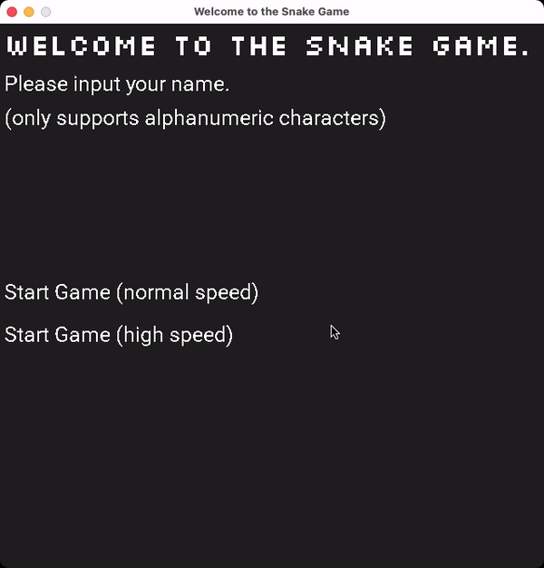

# The Snake Game

This repo is for the Capstone project.



## New Features
* Customize your player name and save your scores.
* Choose normal or high initial speed for your snake.
* Dynamic obstacles and your snake must stay away from them.
* Two kinds of food! Blue food increases the snake's speed. Yellow food will make the snake grow.
* An AI-controlled snake (based on the A* algorithm) competes with your snake. It will eat foods on the screen.

## Game Rules
* Your snake cannot conflict with its own body.
* Your snake cannot conflict with obstacles (grey blocks).
* Your snake can cross the borders of the screen. It can cross the edge and emerge from the opposite side.
* Your snake can overlap with the AI snake. So feel free to compete with the AI snake for more foods.
* Food is represented by circles. The blue circle increases the snake's speed. The yellow circle makes the snake grow.

## Dependencies for Running Locally
* cmake >= 3.7
  * All OSes: [click here for installation instructions](https://cmake.org/install/)
* make >= 4.1 (Linux, Mac), 3.81 (Windows)
  * Linux: make is installed by default on most Linux distros
  * Mac: [install Xcode command line tools to get make](https://developer.apple.com/xcode/features/)
  * Windows: [Click here for installation instructions](http://gnuwin32.sourceforge.net/packages/make.htm)
* SDL2 >= 2.0
  * All installation instructions can be found [here](https://wiki.libsdl.org/Installation)
  * For Linux, run `sudo apt-get install libsdl2-dev`
  * For macOS with Homebrew, run `brew install sdl2`
* SDL_ttf >= 2.0
  * Wiki (build from source): https://wiki.libsdl.org/SDL2_ttf/FrontPage
  * For Linux, run `sudo apt-get install libsdl2-ttf-dev`
  * For macOS with Homebrew, run `brew install sdl2_ttf`
* SDL_image >= 2.0
  * Wiki (build from source): https://wiki.libsdl.org/SDL2_image/FrontPage
  * For Linux, run `sudo apt-get install libsdl2-image-dev`
  * For macOS with Homebrew, run `brew install sdl2_image`
* gcc/g++ >= 5.4
  * Linux: gcc / g++ is installed by default on most Linux distros
  * Mac: same deal as make - [install Xcode command line tools](https://developer.apple.com/xcode/features/)
  * Windows: recommend using [MinGW](http://www.mingw.org/)

## Basic Build Instructions

1. Clone this repo.
2. Make a build directory in the top level directory: `mkdir build && cd build`
3. Compile: `cmake .. && make`
4. Run it: `./SnakeGame`.


## Code Structure

```text
├── CMakeLists.txt
├── CODEOWNERS
├── LICENSE.md
├── README.md
├── assets
│   ├── Roboto-Regular.ttf -- The Roboto font.
│   └── Silkscreen-Regular.ttf -- The Silkscreen font.
├── cmake
│   ├── FindSDL2_image.cmake -- The cmake file to find SDL2_image.
│   └── FindSDL2_ttf.cmake -- The cmake file to find SDL2_ttf.
├── demo.gif
└── src
    ├── a_star.cpp -- The implementation of A* Algorithm.
    ├── a_star.h -- The header file of A* Algorithm.
    ├── button.cpp -- The implementation of Button class.
    ├── button.h -- The header file of Button class.
    ├── controller.cpp -- The implementation of Controller Class.
    ├── controller.h  -- The header file of Controller Class.
    ├── fast_food.cpp -- The implementation of Fast Food Class.
    ├── fast_food.h -- The header file of Fast Food Class.
    ├── food.h -- The header file of the abstract Food Class.
    ├── game.cpp -- The implementation of Game Class.
    ├── game.h -- The header file of Game Class.
    ├── helpers.h -- Helper functions.
    ├── main.cpp -- The program entrance.
    ├── normal_food.cpp -- The implementation of Normal Food Class.
    ├── normal_food.h -- The header file of Normal Food Class.
    ├── obstacle.cpp -- The implementation of Obstacle Class.
    ├── obstacle.h -- The header file of Obstacle Class.
    ├── renderer.cpp -- The implementation of Renderer Class.
    ├── renderer.h -- The header file of Renderer Class.
    ├── snake.cpp -- The implementation of Snake Class.
    ├── snake.h -- The header file of Snake Class.
    ├── text.cpp -- The implementation of Text Class.
    └── text.h -- The header file of Text Class.
```

## Success Criteria
* Compiling and Testing
  * The submission must compile and run without errors on the Udacity project workspace. -- _**Satisfied**_
* Loops, Functions, I/O
  * The project demonstrates an understanding of C++ functions and control structures. -- _**Satisfied**_
  * The project reads data from a file and process the data, or the program writes data to a file. -- `src/game.cpp:138`
  * The project accepts user input and processes the input. -- `src/renderer.cpp:140`
  * The project uses data structures and immutable variables. -- `src/a_star.h:24` `src/a_star.h:59`
* Object Oriented Programming
  * One or more classes are added to the project with appropriate access specifiers for class members. -- `src/a_star.h`
  * Class constructors utilize member initialization lists. -- `src/text.h:26`
  * Classes follow an appropriate inheritance hierarchy with virtual and override functions. -- `src/food.h` `src/fast_food.h`
  * Templates generalize functions or classes in the project. -- `src/helpers.h:13`
* Memory Management
  * The project makes use of references in function declarations. -- `src/a_star.h:56`
  * The project uses destructors appropriately. -- `src/text.cpp:28`
  * The project follows the Rule of 5. -- `src/text.cpp:39`
  * The project uses smart pointers instead of raw pointers. -- `src/a_star.h:38`
* Concurrency
  * The project uses multithreading. -- `src/game.cpp:96`
  * A promise and future is used in the project. -- `src/game.cpp:77`
  * A mutex or lock is used in the project. -- `src/game.cpp:201`